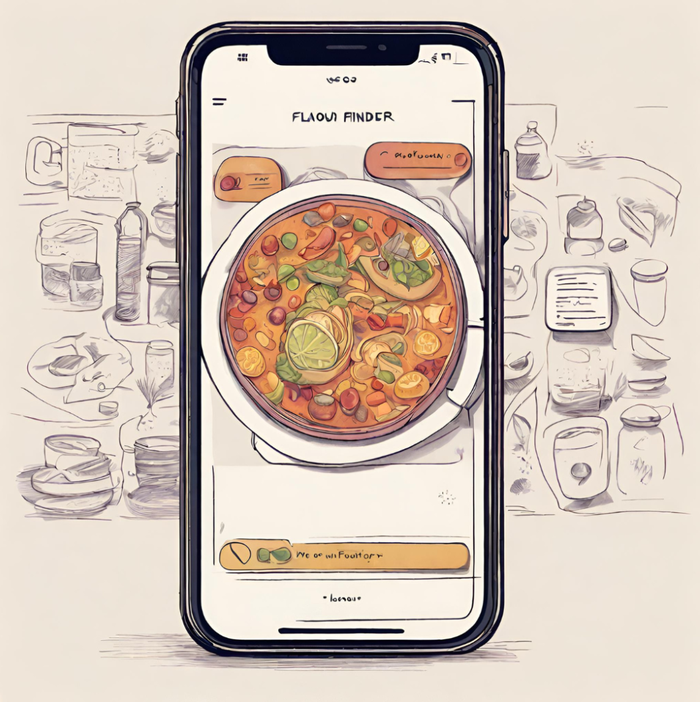
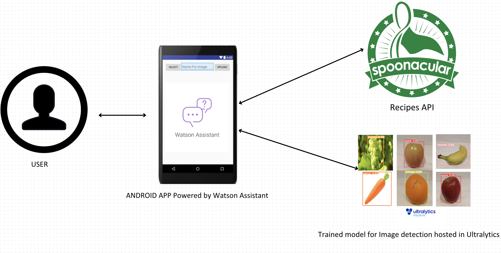
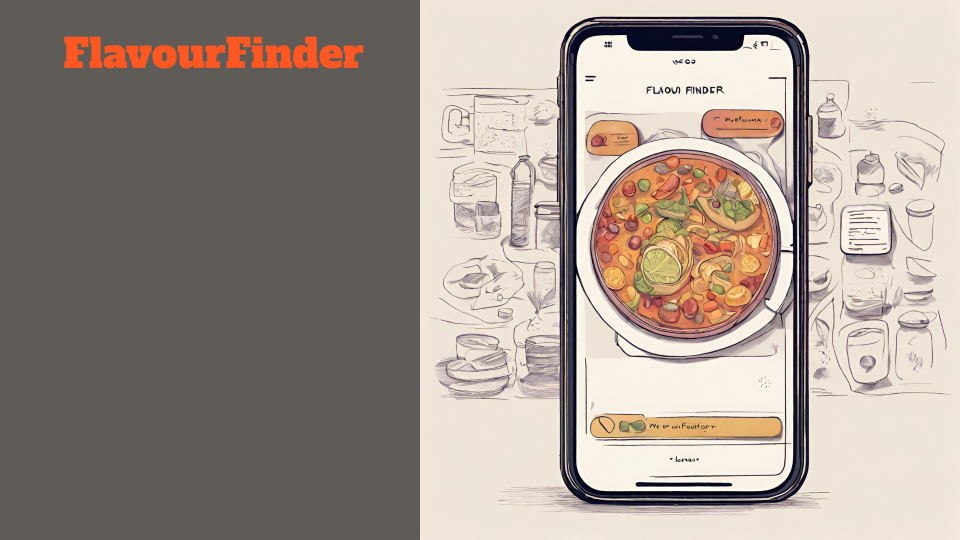
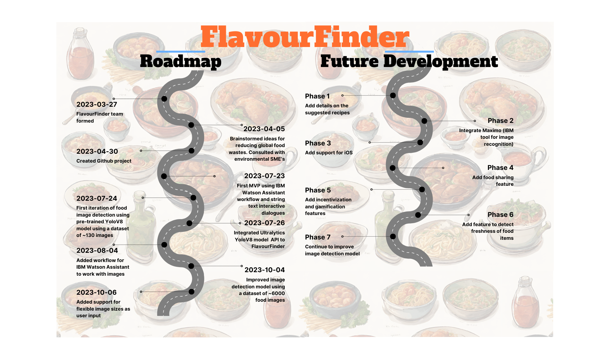

 

# FlavourFinder

- [Project summary](#project-summary)
  - [The issue we are hoping to solve](#the-issue-we-are-hoping-to-solve)
  - [How our technology solution can help](#how-our-technology-solution-can-help)
  - [Our idea](#our-idea)
- [Technology implementation](#technology-implementation)
  - [IBM AI service(s) used](#ibm-ai-services-used)
  - [Solution architecture](#solution-architecture)
- [Presentation materials](#presentation-materials)
  - [Solution demo video](#solution-demo-video)
  - [Project development roadmap](#project-development-roadmap)

## Project summary

### The issue we are hoping to solve

Food waste imposes a great impact on the environment with about 30 to 40% of the food supply within the United States estimated to result to food waste. Food wastes occur at various levels from either the production process or even at a consumer level when consumers buy or cook more food than they need resulting in throwing out extras. Our solution aims to focus on reducing the volume of food wastes particularly within households by encouraging reuse or recycling of foods about to go bad. 

### How our technology solution can help

Our interactive mobile application is designed to analyze images of foods about to go bad, captured and uploaded by users, and subsequently provide recipe suggestions for the specific food items.

### Our idea

Approximately 17% of the global food production is wasted and a substantial portion of the waste originates from households. This greatly impacts the environment as most of the food wastes end up in landfills producing a large amount of greenhouse gases, such as carbon dioxide and methane, thus contributing to global warming and climate change. Furthermore, it leads to a waste of resources such as land, water, labour and energy invested in the production and processing of food that ends up being wasted.

To tackle this issue head-on, our innovative solution is strategically designed to promote the reuse and recycling of foods within households. Our robust approach entails the development of an android application, which interfaces with IBM Watson Assistant- a conversational system designed to engage users in meaningful dialogue. The Assistant will prompt users for images of food that are about to go bad, then a list of food items would be detected based on the uploaded image. Image detection is performed utilizing our trained model, which was derived from the training of a foundational YOLOv8 model (a sophisticated object detection model) on our custom dataset encompassing over 6,000 food images. Upon the classification of food items, a dynamic sequence is triggered, involving an API call to Spoonacular, a food API that allows access to over 5,000 recipes, that would return a list of recipes tailored to the classified food ingredients that users can choose from. 

Remarkably user-friendly, this streamlined process helps tackle food waste problems with the simple act of users having to upload food images and a list of various recipes would be suggested, thus prompting the productive use of foods that would otherwise end up in trash.

Our current implementation is limited as our model was trained on a small set of images causing the detection process to identify a small set of foods. However, our future implementation plans encompasses a substantial expansion of our training dataset so as to make our predictions more accurate and have a variety of food items identified. 

Moreover, we would also like to refine our image detection process by also identifying the freshness levels of foods, thereby prioritizing recipes for food items that are least fresh. 

To further encourage the reduction of food loss and waste, our application goes beyond the realm of individual households. It extends an open hand to users, giving users an opportunity to share surplus food with nearby individuals or contribute to charitable causes, thus directing excess foods toward those in need. Thus encouraging a more sustainable and resource-efficient environment where food waste is highly unlikely.

## Technology implementation

### IBM AI service(s) used

- [Watson Assistant](https://cloud.ibm.com/catalog/services/watson-assistant) - The Watson Assistant is integrated within our android application serving as a conversational system with the users. Through an interactive dialogue conversation, the assistant will prompt the user to upload food images. The uploaded image would then be sent to the model for image prediction and this would return a list of ingredients as identified from the image. Then the list of ingredients is sent to Spoonacular API which would return a list of recipes based on the ingredients. The list of recipes would then be displayed in the application as suggestions to which the user can pick any of the recipe they are interested in.
  - The main class of our android application, [MainActivity.kt](https://github.com/lebriankim/FlavourFinder/blob/main/android-app/app/src/main/java/com/example/recipe/MainActivity.kt#L38), calls the IBM Watson Assistant service by rendering the webview of IBM Watson's chat views and functions that are defined in the [index.html](./android-app/app/src/main/assets/index.html) file.

### Solution architecture

Diagram and step-by-step description of the flow of our solution:

1. Watson Assistant prompts the user to upload an image
2. User uploads food image to Android application
3. The application sends the uploaded image to our image detection model through the Ultralytics API for image prediction
4. The model detects food items based on the uploaded image and returns a list of identified food items
5. Watson Assistant then sends the list of identified food items generated to Spoonacular API to generate recipes
6. Watson Assistant displays a list of recipes

Links:
- Image Detection Model (hosted on ultralytics HUB) [FlavourFinder - v2](https://hub.ultralytics.com/models/af6qKxjR7JKNq39pWmPK)
- Image Detection Training Dataset (hosted on ultralytics HUB) [Eggs.v5-custom_data5.yolov8](https://hub.ultralytics.com/datasets/mG8GrG6fJLqUVTOMENZH)
- Spoonacular Food API [https://spoonacular.com/food-api](https://spoonacular.com/food-api)

## Presentation materials

### Solution demo video

### Project development roadmap

The project currently does the following things.

- Runs on Android.
- Generates recipes based on list of food items entered by user.
- Generates recipes based on picture of food items uploaded by user.
- Generates up to 10 recipes per a request.
- Displays pictures of recipes generated.

In the future we plan to...

See below for our proposed schedule on next steps after Call for Code 2023 submission.

